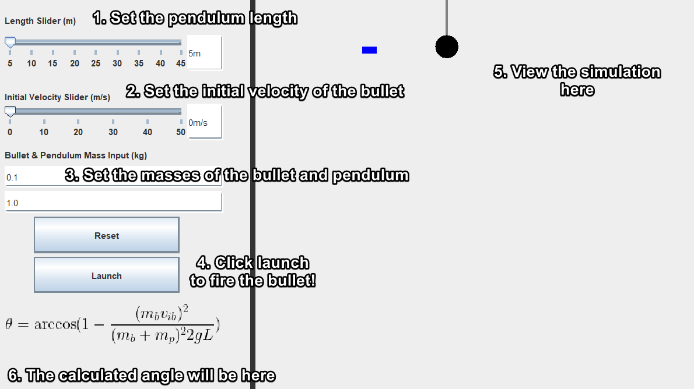

<h1 align= "center">Ballistic Pendulum</h1>

  This project is a visual representation of how the ballistic pendulum experiment works to demonstrate inelastic collisions in Grade 12 Physics. 

 

  

 

## How it Works
This project was created in Java Swing GUI.
- Calculates the angle that the pendulum swings up, using parameters such as the bullet's initial velocity or the pendulum's rope length, which can be modified by the user
- Using the angle and rope length, the (x,y) positioning of the bob and sticking bullet are modified to move in a pendulum arc upwards
- Uses javax.swing components for parameters and java.awt for Graphics painting of animations

